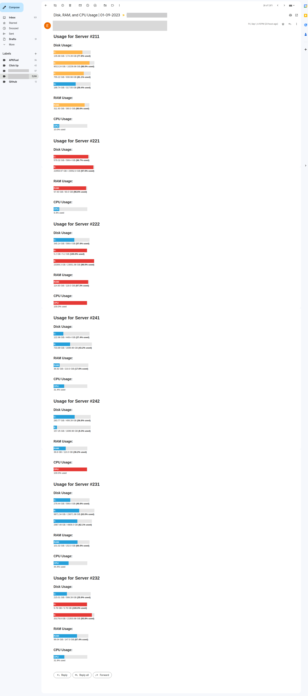

# Disk, CPU, and RAM Monitor



## Overview

This Python-based monitoring tool provides insights into the disk, CPU, and RAM usage of both local and remote servers in a distributed computing environment. It offers a comprehensive view of resource utilization, helping you manage and optimize server performance.

## Features

- **Local and Remote Monitoring**: Monitor resources on both the local machine and remote servers.
- **Disk Usage**: Track disk space utilization, including total space, used space, free space, and usage percentage.
- **RAM Usage**: Monitor RAM usage, including total RAM, available RAM, used RAM, free RAM, and usage percentage.
- **CPU Usage**: Keep an eye on CPU usage as a percentage of total capacity.
- **Alert Thresholds**: Define alert thresholds for disk, RAM, and CPU usage to receive notifications when thresholds are exceeded.
- **HTML Report**: Generate an HTML report with colorful visualizations for easy resource consumption analysis.
- **Distributed Computing**: Suitable for environments with multiple servers and distributed computing tasks.
- **Email Alerts**: Configure email alerts to notify relevant team members when critical resource thresholds are reached.

## How to Use

1. Clone this repository to your local machine.

2. Install the required dependencies:
   ```
   pip install -r requirements.txt
   ```
3. Configure the monitoring parameters in the disk_monitoring.py script.

4. Run the monitoring script:
   ```
   python disk_monitoring.py
   ```
5. View the HTML report generated in the same directory.

## Configuration
- Master Node: Modify the master variable in disk_monitoring.py to set the master node's IP address.
- Server List: Adjust the servers list to specify the remote server nodes.
- Alert Thresholds: Customize threshold values for disk, RAM, and CPU usage alerts in the script.

## SSH Setup for Remote Monitoring

Before you can remotely monitor servers using this tool, you need to set up SSH access to the remote servers and ensure that Plink is configured properly.

### Initial SSH Configuration

**Manual SSH Login**: Perform the initial SSH login manually to each remote server:
```
ssh username@remote_server_ip
```
- Replace username with your SSH username.
- Replace remote_server_ip with the IP address of the remote server.

During the first SSH login, you will be prompted to confirm the server's authenticity.

1. Enter Password: Enter the password for your SSH user account when prompted.

2. SSH Key Verification: After successfully logging in, SSH will store the server's host key locally.

## Plink Configuration

1. **[Download Plink](https://www.chiark.greenend.org.uk/~sgtatham/putty/latest.html)**: Download and install Plink from the official website.

2. **Store SSH Keys**: Ensure that the SSH keys generated during the manual SSH login are stored in your SSH directory. These keys are used for key-based authentication when running the monitoring script remotely.

3. Configure Plink Command: In disk_monitoring.py, configure the Plink command:
```
plink_command = [
    "plink", "-batch", "-pwfile", "C:\\location_dir_for_pass\\pass.txt", "-ssh",
    f"user@ip", "python3",
    f"{remote_working_dir.replace('xyz', node)}remote_disk_monitor.py"
]
```
- Replace "C:\\location_dir_for_pass\\pass.txt" with the path to your SSH password file.
- Ensure Plink is in your system's PATH.

# Remote Server Monitoring
Now you can remotely monitor servers. Simply run the monitoring script to collect and analyze resource usage data from remote servers.

Enjoy efficient server monitoring!

## Contact
For inquiries and feedback, please contact [khaleel.org@gmail.com] or [+923076482365].


